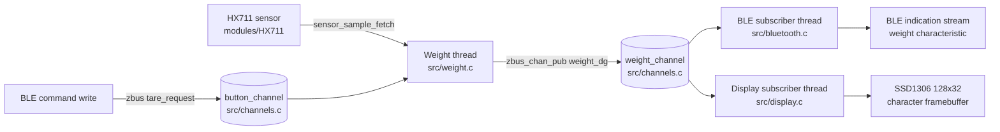

# ncs-scale

Smart scale firmware built with nRF Connect SDK (Zephyr) for Nordic nRF52 boards.

This application reads weight from an HX711 load cell amplifier, publishes measurements over Zephyr zbus, exposes a connected Bluetooth LE GATT interface for a Gaggiuino-compatible scale client, and can render live values on an SSD1306 display.

## Architecture Overview

The design follows a small event-driven pipeline:

1. `weight.c` samples the HX711 sensor in its own thread.
2. Each sample is converted to deci-grams and published to `weight_channel` on zbus.
3. Subscribers react asynchronously:
  - `bluetooth.c` encodes and indicates BLE weight frames.
  - `display.c` updates the framebuffer and draws status icons.
4. BLE command writes are forwarded onto `button_channel` so tare stays decoupled from the transport layer.



## Key Architectural Elements

### 1) Sensor Ingestion (`src/weight.c`)

- Own dedicated thread (`K_THREAD_DEFINE`) samples every 100 ms.
- Acquires HX711 using devicetree (`DEVICE_DT_GET_ANY(avia_hx711)`).
- Performs startup tare and applies a configured slope for conversion.
- Converts the reading to signed deci-grams (`0.1g`) and publishes `struct weight_msg` to zbus (`weight_channel`).

Why this matters:
- Sensor sampling is isolated from output transport and UI refresh.
- Timing-sensitive read loop is not blocked by BLE/display work.
- The rest of the application no longer depends on Zephyr's `sensor_value` representation.

### 2) Event Bus (`src/channels.c`, `include/channels.h`)

- Uses Zephyr zbus to decouple producer and consumers.
- Defines channels:
  - `weight_channel` carrying `struct weight_msg { int32_t weight_dg; }`.
  - `button_channel` carrying `struct button_msg { bool tare_request; }`.
- Includes utility logging to inspect channels and attached observers at runtime.

Why this matters:
- New outputs (for example logging, storage, cloud uplink) can subscribe without changing sensor code.
- BLE tare handling is transport-agnostic because command writes become plain app messages.

### 3) Bluetooth GATT Interface (`src/bluetooth.c`, `src/bluetooth_protocol.c`)

- Initializes Zephyr Bluetooth stack and starts connectable LE advertising.
- Exposes a GATT service with:
  - Weight characteristic: `0x2A9D`
  - Command characteristic: `553f4e49-bf21-4468-9c6c-0e4fb5b17697`
- Starts weight streaming only after the client enables indications and sends the expected stream-start write.
- Sends weight updates as indications on each `weight_channel` update.
- Converts incoming tare command writes into `button_channel` messages.

Implementation notes:
- Internal weight is already in deci-grams, so protocol packing is just frame encoding.
- The helper module `bluetooth_protocol.c` contains protocol-specific request matching and frame packing.
- Advertising is restarted after disconnect so the scale becomes discoverable again without reboot.

### 4) Display Rendering (`src/display.c`)

- Uses chosen display device from devicetree (`DT_CHOSEN(zephyr_display)`).
- Initializes Character Framebuffer (CFB) API.
- Subscriber listens to deci-gram weight updates and redraws:
  - Numeric weight value.
  - Status icons (Bluetooth, Wi-Fi placeholder, battery).

Why this matters:
- Presentation logic remains independent from acquisition logic.

### 5) Startup and Runtime (`src/main.c`)

- `main()` initializes high-level services and prints zbus topology:
  - `zbus_print_channels_and_observers()`
  - `bt_init()`
  - `display_init()` when display support is enabled
- Weight acquisition thread starts independently from `K_THREAD_DEFINE`.
- Main loop exists mainly as a heartbeat/logging anchor.

## Project Layout

```text
ncs-scale/
  CMakeLists.txt              # App target, sources, shield and module wiring
  prj.conf                    # Zephyr/NCS Kconfig selections
  boards/
    nrf52dk_nrf52832.overlay  # HX711 GPIO wiring for this board
  include/
    bluetooth.h
    bluetooth_protocol.h
    channels.h
    display.h
  modules/
    HX711/                    # Local Zephyr module for HX711 sensor driver
  src/
    main.c
    channels.c
    weight.c
    bluetooth.c
    bluetooth_protocol.c
    display.c
```

## Configuration Surfaces

### Kconfig (`prj.conf`)

- Logging: `CONFIG_LOG`, minimal mode.
- Messaging: `CONFIG_ZBUS` and observer/channel metadata logging.
- Sensor: `CONFIG_HX711`.
- BLE: peripheral role, TX power, and advertised device name.
- Display: framebuffer and print formatting support.

### CMake (`CMakeLists.txt`)

- Adds local module path: `modules/HX711` via `ZEPHYR_EXTRA_MODULES`.
- Registers all source units in one app target.
- Includes `src/display.c` only when `CONFIG_DISPLAY=y`.

### Devicetree (`boards/nrf52dk_nrf52832.overlay`)

- Declares `avia,hx711` node and pin bindings:
  - `dout-gpios` on `gpio0.24`
  - `sck-gpios` on `gpio0.25`

## Build and Flash (NCS Extension)

This project is intended to be used from the nRF Connect extension in VS Code.

Recommended workflow:

1. Open the repository as an NCS application workspace.
2. Select the board target (`nrf52dk/nrf52832`) in the extension UI.
3. Use the extension actions for Configure, Build, and Flash.
4. Use the extension panels for Kconfig/devicetree configuration and logging.

### Enabling Display in the NCS Extension

The default project configuration is headless (`CONFIG_DISPLAY=n`).

For a display-enabled build profile in the extension:

1. Set Shield to `ssd1306_128x32` in the build configuration.
2. Set `CONFIG_DISPLAY=y`.
3. Set `CONFIG_CHARACTER_FRAMEBUFFER=y`.
4. Run a pristine configure/build from that profile.

For a headless profile, leave shield unset and keep display options disabled.

## Current Design Constraints

- Sensor path assumes a single HX711 instance (`DEVICE_DT_GET_ANY`).
- BLE interface currently assumes a single connected central and a single protocol shape.
- Internal application weight unit is deci-grams (`0.1g`).
- Display support is optional and only enabled in display builds.

These are good next abstraction points if you plan to create product variants (headless mode, dual-scale inputs, or alternate BLE protocols).

## Extension Guidance

Recommended safe extension pattern:

1. Keep sensor acquisition as producer-only logic.
2. Keep app-level weight data in deci-grams and convert only at hardware/protocol boundaries.
3. Add new zbus channels or reuse `weight_channel` for additional subscribers.
4. Implement protocol-specific payload adapters instead of hardcoding in subscriber loop.
5. Gate optional features with Kconfig flags so one codebase can serve multiple builds.
