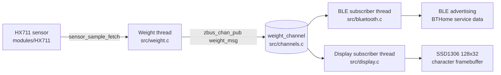

# ncs-scale

Smart scale firmware built with nRF Connect SDK (Zephyr) for Nordic nRF52 boards.

This application reads weight from an HX711 load cell amplifier, publishes measurements over Zephyr zbus, advertises data over Bluetooth LE (BTHome service data), and renders live values on an SSD1306 display.

## Architecture Overview

The design follows a small event-driven pipeline:

1. `weight.c` samples the HX711 sensor in its own thread.
2. Each sample is published to `weight_channel` on zbus.
3. Subscribers react asynchronously:
   - `bluetooth.c` encodes and updates BLE advertising payload.
   - `display.c` updates the framebuffer and draws status icons.



## Key Architectural Elements

### 1) Sensor Ingestion (`src/weight.c`)

- Own dedicated thread (`K_THREAD_DEFINE`) samples every 100 ms.
- Acquires HX711 using devicetree (`DEVICE_DT_GET_ANY(avia_hx711)`).
- Performs startup tare and applies a configured slope for conversion.
- Publishes `struct weight_msg` to zbus (`weight_channel`).

Why this matters:
- Sensor sampling is isolated from output transport and UI refresh.
- Timing-sensitive read loop is not blocked by BLE/display work.

### 2) Event Bus (`src/channels.c`, `include/channels.h`)

- Uses Zephyr zbus to decouple producer and consumers.
- Defines channels:
  - `weight_channel` carrying `struct weight_msg`.
  - `button_channel` carrying `struct button_msg` (currently reserved/unused).
- Includes utility logging to inspect channels and attached observers at runtime.

Why this matters:
- New outputs (for example logging, storage, cloud uplink) can subscribe without changing sensor code.

### 3) Bluetooth Broadcasting (`src/bluetooth.c`)

- Initializes Zephyr Bluetooth stack and starts LE advertising.
- Encodes weight + battery into BTHome service data (UUID `0xFCD2`).
- On each `weight_channel` update, subscriber refreshes advertising data.

Implementation notes:
- Current payload format is BTHome-specific.
- Mass is packed into a 16-bit scaled integer (decigram-style scaling path).

### 4) Display Rendering (`src/display.c`)

- Uses chosen display device from devicetree (`DT_CHOSEN(zephyr_display)`).
- Initializes Character Framebuffer (CFB) API.
- Subscriber listens to weight updates and redraws:
  - Numeric weight value.
  - Status icons (Bluetooth, Wi-Fi placeholder, battery).

Why this matters:
- Presentation logic remains independent from acquisition logic.

### 5) Startup and Runtime (`src/main.c`)

- `main()` initializes high-level services and prints zbus topology:
  - `zbus_print_channels_and_observers()`
  - `bt_init()`
  - `display_init()` when display support is enabled
- Weight acquisition thread starts independently from `K_THREAD_DEFINE`.
- Main loop logs uptime periodically.

## Project Layout

```text
ncs-scale/
  CMakeLists.txt              # App target, sources, shield and module wiring
  prj.conf                    # Zephyr/NCS Kconfig selections
  boards/
    nrf52dk_nrf52832.overlay  # HX711 GPIO wiring for this board
  include/
    bluetooth.h
    channels.h
    display.h
  modules/
    HX711/                    # Local Zephyr module for HX711 sensor driver
  src/
    main.c
    channels.c
    weight.c
    bluetooth.c
    display.c
```

## Configuration Surfaces

### Kconfig (`prj.conf`)

- Logging: `CONFIG_LOG`, minimal mode.
- Messaging: `CONFIG_ZBUS` and observer/channel metadata logging.
- Sensor: `CONFIG_HX711` and optional median + EMA filter tuning.
- BLE: broadcaster, TX power, and advertised device name.
- Display: framebuffer and print formatting support.

### CMake (`CMakeLists.txt`)

- Adds local module path: `modules/HX711` via `ZEPHYR_EXTRA_MODULES`.
- Registers all source units in one app target.
- Includes `src/display.c` only when `CONFIG_DISPLAY=y`.

### Devicetree (`boards/nrf52dk_nrf52832.overlay`)

- Declares `avia,hx711` node and pin bindings:
  - `dout-gpios` on `gpio0.24`
  - `sck-gpios` on `gpio0.25`

## Build and Flash (NCS Extension)

This project is intended to be used from the nRF Connect extension in VS Code.

Recommended workflow:

1. Open the repository as an NCS application workspace.
2. Select the board target (`nrf52dk/nrf52832`) in the extension UI.
3. Use the extension actions for Configure, Build, and Flash.
4. Use the extension panels for Kconfig/devicetree configuration and logging.

### Enabling Display in the NCS Extension

The default project configuration is headless (`CONFIG_DISPLAY=n`).

For a display-enabled build profile in the extension:

1. Set Shield to `ssd1306_128x32` in the build configuration.
2. Set `CONFIG_DISPLAY=y`.
3. Set `CONFIG_CHARACTER_FRAMEBUFFER=y`.
4. Run a pristine configure/build from that profile.

For a headless profile, leave shield unset and keep display options disabled.

## Current Design Constraints

- Sensor path assumes a single HX711 instance (`DEVICE_DT_GET_ANY`).
- BLE format is currently fixed to BTHome service data encoding.
- Display support is optional and only enabled in display builds.

These are good next abstraction points if you plan to create product variants (headless mode, dual-scale inputs, or alternate BLE payloads).

## Extension Guidance

Recommended safe extension pattern:

1. Keep sensor acquisition as producer-only logic.
2. Add new zbus channels or reuse `weight_channel` for additional subscribers.
3. Implement protocol-specific payload adapters instead of hardcoding in subscriber loop.
4. Gate optional features with Kconfig flags so one codebase can serve multiple builds.
